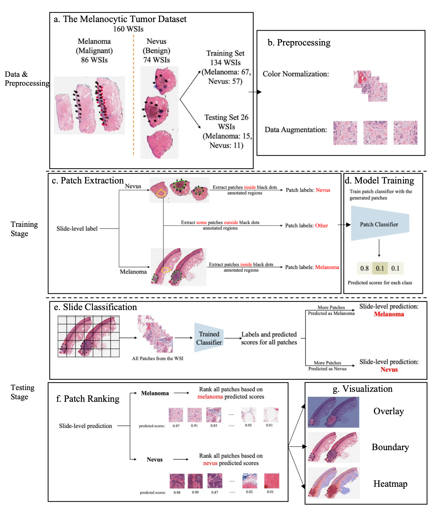
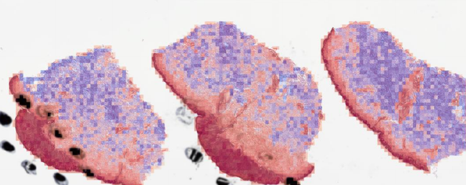

# Region of Interest Detection in Melanocytic Skin Tumor Whole Slide Images [](https://code.visualstudio.com/)

[](https://github.com/cyMichael/ROI_Detection)

Codes for the paper: Region of Interest Detection in Melanocytic Skin Tumor Whole Slide Images. (Model: **PCLA-3C**).

## Updates

- See some downsampled visualization results on TCGA-SKCM in folder [tcga_visual](/tcga_visual). Full-size samples on TCGA-SKCM will be made available via google drive after review later.

[toc]


[Overview](#Overview)•[Setup](#Setup)•[Training](#Training)•[Visualization](#Visualization)•[Reproducibility](#Reproducibility)•[Issues](#Issues)•[Acknowledgments](#Acknowledgments)

## Overview

Automated region of interest detection in histopathological image analysis is a challenging and important topic with tremendous potential impact on clinical practice. The deep-learning methods used in computational pathology help us to reduce costs and increase the speed and accuracy of regions of interest detection and cancer diagnosis. In this work, we proposed a patch-based region of interest detection method for melanocytic skin tumor whole-slide images. We worked with a dataset that contains 165 primary *melanomas* and *nevi* Hematoxylin and Eosin whole-slide images and built a deep-learning method. The proposed method performed well on a hold-out test dataset including five TCGA-SKCM slides (accuracy of 93.94% in the slide classification task and intersection over union rate of 41.27% in the region of interest detection task), showing the outstanding performance of our model on melanocytic skin tumor. Even though we tested the experiments on the skin tumor dataset, our work could also be extended to other medical image detection problems, such as various tumors' classification and prediction, to benefit the clinical evaluation and diagnosis of different tumors.


<center>ROI was annotated by black dots determined by pathologists. The predicted ROI was bounded by the green line on the right.<center>

Here is the flowchart for our paper:



<center>Overview of the proposed detection framework. a) Extract melanoma, nevus and other patches from training data. b) Train a 3-class patch classifier based on extracted patches. c) For each slide, generate predicted scores for all patches and calculate patch as well as slide classification accuracy. d) Rank all patches from a slide based on the corresponding predicted scores in the context of melanoma or nevus, depending on the slide classification result. e) Generate visualization results based on predicted scores.<center>


## Setup

### Computational Configuration

- All analyses were used by Python. Images were analyzed and processed using OpenSlide. 
- All the computational tasks were finished on UNC Longleaf Cluster with Linux (Tested on Ubuntu 18.04) and NVIDIA GPU (Tested on Nvidia GeForce RTX 3090 on local workstations). 
- CUDA (Tested on CUDA 11.3).
- torch>=1.7.1.

### Basic Structure of Codes

- **extract_patches_3class.py**: extract patches from whole slide images with annotation files (.xml). Split annotated patches into training, testing and validation. 
- **method_pcla_3class.py**: train patch classification model on annotated patches (PCLA-3C).
- **score_pcla_3class.py**: compute predicted scores for all patches from WSI with the trained model.
- **visual.py**: generate visualization maps (heatmap, overlay, boundary).
- **analysis.py**: calculate the IoU value.

You need to generate a CSV file that contains 'slide_id', 'data_split', and 'label' for training the model.

## Training

Training and Region of Interest Detection

Here are example commands for training the patch classification model and performing ROI detection.

### Train Patch Classification Model (PCLA-3C)

Step 0: color normalization.

Step 1: patch extraction: extracting patches from whole slide images with annotation files (.xml). Depending on the annotations, the extracted patches may belong to different classes. Save patches to corresponding directories (train/val/test) based on CSV file.

```python
python extract_patches_3class.py --data_dir PATH_TO_SAVE_MEL/PATCHES --csv_path PATH_TO_CSV --xml_annotation_new PATH_TO_SAVE_ANNOTATED_PATCHES/ANNOTATIONS_NEW --xml_annotation_other PATH_TO_SAVE_ANNOTATED_PATCHES/ANNOTATIONS_OTHER --feat_dir PATH_TO_SAVE_FEATURES
```

Step 2: train patch classification model (PCLA-3C).

```python
python method_pcla_3class.py --exp_name 'pcla_3class' --data_folder PATH_TO_SAVE_FEATURES --batch_size 100 --n_epochs 20
```

Step 3: calculate predicted scores for all extracted patches.

```python
python score_pcla_3class.py --exp_name 'pcla_3class' --auto_skip --model_load TRAINED_MODEL --csv_path PATH_TO_CSV --patch_path PATH_TO_ALL_FEATURES --results_dir PATH_TO_SAVE_RESULTS --classification_save_dir PATH_TO_SAVE_CLASSIFICATION_RESULTS
```

Step 4: generate an overlap map.

```python
python visual.py --auto_skip --percent PERCENT_NUMBER --xml_dir PATH_TO_XML --exp_name 'pcla_3class' --csv_path PATH_TO_CSV --wsi_dir PATH_TO_WSI --results_dir PATH_TO_SAVE_RESULTS --xml_dir PATH_TO_GROUND_TRUTH_LABELS --annotation_ratio ANNOTATION_NUMBER
```

By setting `--heatmap` or `--boundary`, the other two types of visualization results can also be generated.

Step 5: calculate the IoU value.

```python
python analysis.py --results_dir RESULT_TO_CSV --csv_dir PATH_TO_CSV
```

## Visualization Examples

Here are some examples of the melanoma sample and nevus sample.

### Visualization results for a melanoma sample.


<center>Boundary<center>


<center>Heatmap<center>


<center>Overlay<center>
### Visualization results for a nevus sample.


<center>Boundary<center>



<center>Heatmap<center>


<center>Overlay<center>
## Reproducibility

The melanocytic skin tumor dataset will be made public in the future. To reproduce the results on the TCGA-SKCM dataset, the pre-trained model is available at the [model]() (for anonymization, the link will be provided after the paper review).

## Issues

- Please report all issues on the public forum.

## Acknowledgments

- This version is modified by the version from https://github.com/roidetection/roi_detection.

- This code of patch extraction is inspired by [CLAM](https://github.com/mahmoodlab/CLAM).
