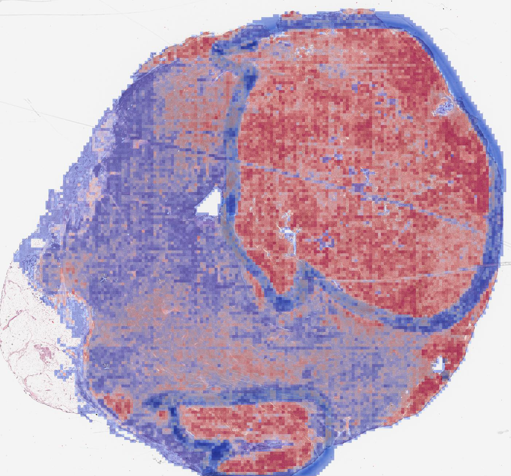
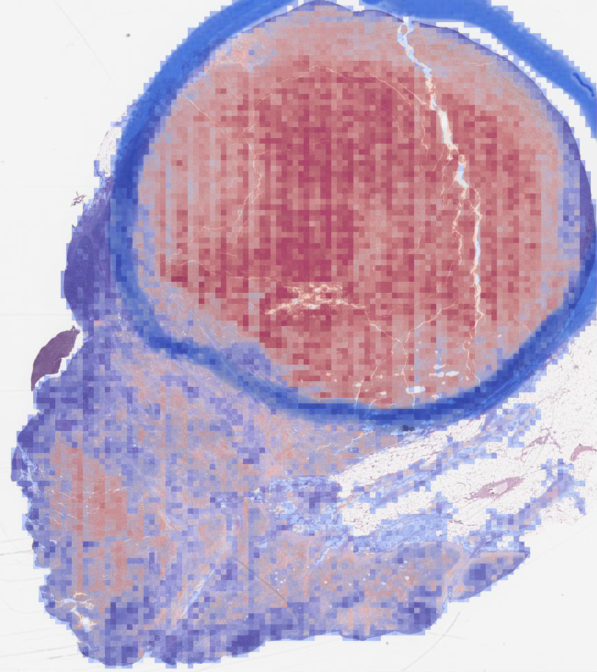
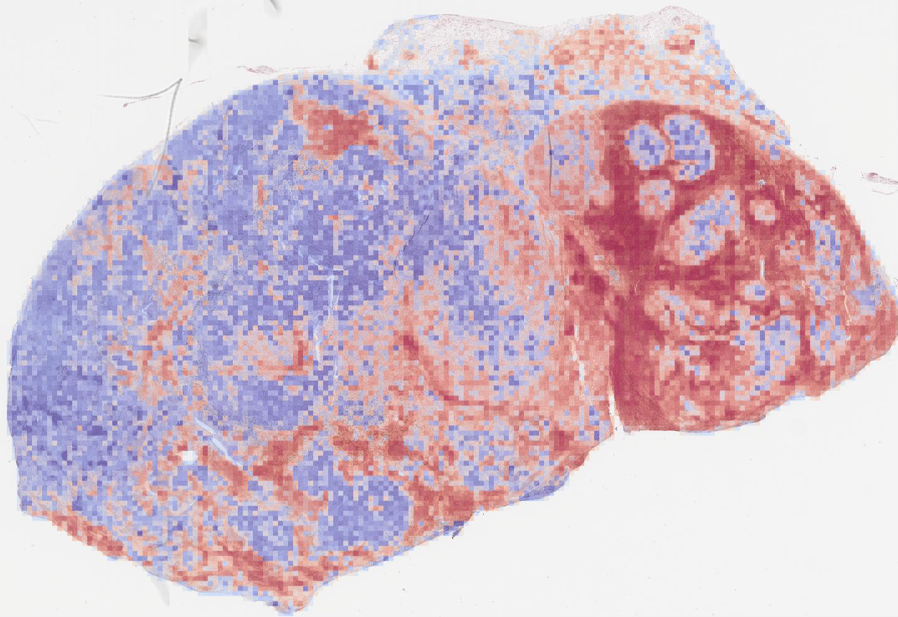

# Transfer learning on TCGA-SKCM

## Overview
To better evaluate the method, the model is deployed to the TCGA skin cancer dataset. The model is directly applied to the TCGA dataset without fine-tuning since patch-level labels are not available for TCGA dataset. For some TCGA slides, there are some annotations on them, but we are not sure what the annotations are made for. Even though the color, scan method and many other factors make the TCGA dataset very different from the melanocytic dataset used in the paper, the model is able to find out annotated regions in those TCGA slides. See some examples below. More results can be found at folder [images](/tcga_visual/images).

## Examples
 

 

 

 

 

## Results on Other Example

 
